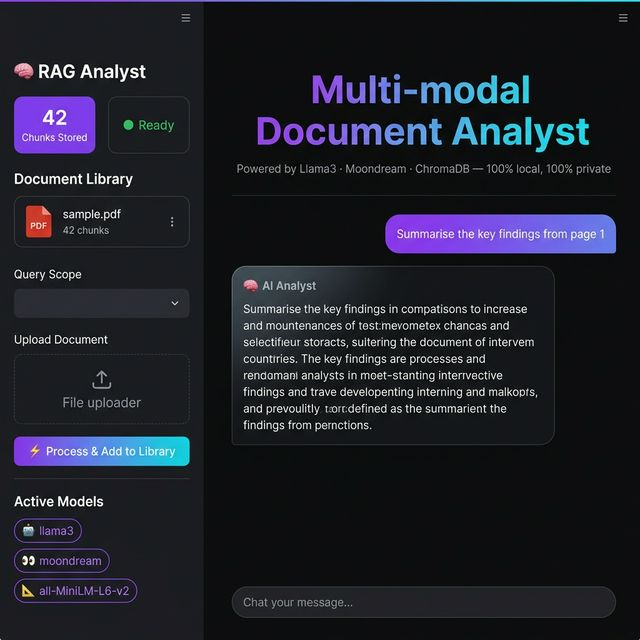

<div align="center">

# 🧠 Multi-modal RAG Document Analyst

**A 100% local, privacy-first document intelligence system**  
*powered by Llama 3 · Moondream · ChromaDB · Streamlit*



[](https://python.org)
[](https://streamlit.io)
[](https://www.trychroma.com)
[](https://ollama.ai)
[](LICENSE)

</div>

---

## 📖 Table of Contents

1. [Overview](#overview)
2. [Features](#features)
3. [Architecture](#architecture)
4. [Requirements](#requirements)
5. [Setup & Installation](#setup--installation)
6. [Running the App](#running-the-app)
7. [Usage Guide](#usage-guide)
8. [Project Structure](#project-structure)
9. [Configuration](#configuration)
10. [How It Works](#how-it-works)
11. [Troubleshooting](#troubleshooting)
12. [License](#license)

---

## Overview

**Multi-modal RAG Document Analyst** is a fully offline, Retrieval-Augmented Generation (RAG) system that lets you upload PDF documents and ask questions about them using natural language. Both **text content** and **visual content** (charts, tables, images) are indexed — making it truly multi-modal.

> 🔒 **Privacy first** — Nothing leaves your machine. All models run locally via Ollama.

---

## Features

| Feature | Detail |
|---|---|
| 📄 PDF ingestion | Drag-and-drop PDF upload with real-time progress bar |
| 🖼️ Multi-modal indexing | Every page rendered as image → described by Moondream VLM |
| 🔍 Semantic search | `all-MiniLM-L6-v2` embeddings + ChromaDB vector store |
| 🤖 LLM reasoning | Llama 3 generates answers grounded in retrieved chunks |
| 🎯 Scoped queries | Ask about one document or all documents at once |
| 📚 Document library | Add, view, and delete individual documents |
| 🗑️ Persistent storage | ChromaDB on disk — survives app restarts |
| 💻 100% local | No API keys, no cloud, no data sharing |
| 🎨 Premium dark UI | Glassmorphism, animated gradients, Inter typography |

---

## Architecture

```
┌──────────────────────────────────────────────────────────────────┐
│                        Streamlit Frontend (app.py)               │
│   ┌─────────────────┐              ┌───────────────────────────┐ │
│   │    Sidebar       │              │      Main Chat Area       │ │
│   │  • Upload PDF    │              │  • Chat history           │ │
│   │  • Doc library   │              │  • Source image refs      │ │
│   │  • Query scope   │              │  • Chat input             │ │
│   │  • DB stats      │              │                           │ │
│   └────────┬────────┘              └──────────────┬────────────┘ │
└────────────┼─────────────────────────────────────┼──────────────┘
             │ process_pdf()                         │ generate_answer()
             ▼                                       ▼
┌────────────────────────┐          ┌──────────────────────────────┐
│    ingest.py           │          │      query_engine.py         │
│                        │          │                              │
│  1. extract_text()     │          │  1. embed query (MiniLM)     │
│     PyMuPDF → chunks   │          │  2. ChromaDB top-k search    │
│                        │          │  3. Build RAG prompt         │
│  2. extract_images()   │          │  4. Ollama → Llama 3         │
│     PyMuPDF → 150DPI   │          │                              │
│     page PNGs          │          └──────────────────────────────┘
│                        │
│  3. describe_image()   │          ┌──────────────────────────────┐
│     Ollama → Moondream │          │      resources.py            │
│                        │          │  • SentenceTransformer       │
│  4. store_in_chroma()  │──────────│  • ChromaDB PersistentClient │
│     embed + upsert     │          │  • Lazy singletons           │
└────────────────────────┘          └──────────────────────────────┘
```

---

## Requirements

### System Requirements

| Component | Minimum | Recommended |
|---|---|---|
| OS | Windows 10 / Ubuntu 20.04 | Windows 11 / Ubuntu 22.04 |
| Python | 3.10 | 3.10+ |
| RAM | 8 GB | 16 GB |
| GPU | NVIDIA 4 GB VRAM | NVIDIA 8 GB+ VRAM |
| Disk | 10 GB free | 20 GB free |

### External Dependencies

- **[Ollama](https://ollama.ai)** — local LLM runner (must be installed separately)
- **Llama 3** model (`ollama pull llama3`)
- **Moondream** vision model (`ollama pull moondream`)

---

## Setup & Installation

### Step 1 — Clone the repository

```bash
git clone https://github.com/your-username/rag-document-analyst.git
cd rag-document-analyst
```

### Step 2 — Install Ollama

Download and install Ollama from [https://ollama.ai](https://ollama.ai).

Then pull the required models:

```bash
ollama pull llama3
ollama pull moondream
```

> ⚠️ Make sure Ollama is running in the background before starting the app.

### Step 3 — Create a virtual environment

```bash
# Windows
python -m venv venv
venv\Scripts\activate

# macOS / Linux
python3 -m venv venv
source venv/bin/activate
```

### Step 4 — Install Python dependencies

```bash
pip install --upgrade pip
pip install -r requirements.txt
```

> 💡 If you have a CUDA-capable GPU, PyTorch will automatically utilise it for the vision pipeline. CPU-only mode is fully supported.

---

## Running the App

```bash
# Make sure Ollama is running, then:
streamlit run app.py
```

The app will open at **http://localhost:8501** in your browser.

### CLI Usage (headless)

**Ingest a PDF from the command line:**
```bash
python ingest.py path/to/your/document.pdf
```

**Query the knowledge base from the command line:**
```bash
python query_engine.py "Summarise the key findings"
```

---

## Usage Guide

### 1. Upload a Document

1. Open the app at `http://localhost:8501`
2. In the **sidebar**, click **"Browse files"** and select a PDF
3. Click **"⚡ Process & Add to Library"**
4. Wait for the progress bar to complete (VLM describes each page — takes ~10–30 s per page)

### 2. Ask Questions

1. Type your question in the chat input at the bottom
2. Press **Enter** to submit
3. The AI will retrieve the most relevant chunks and generate an answer
4. Source image references are shown below the answer when visual evidence is used

### 3. Manage Documents

| Action | How |
|---|---|
| View all docs | Check the **Document Library** in the sidebar |
| Scope to one document | Use the **Query Scope** dropdown |
| Delete one document | Click the 🗑️ icon next to a document |
| Clear everything | Click **"🗑️ Clear Entire Library"** |

### 4. Suggested Queries

- `Summarise the key findings`
- `Describe the charts on page 1`
- `List all numbers and statistics mentioned`
- `What are the main conclusions?`
- `What images or diagrams are in this document?`

---

## Project Structure

```
RAG/
├── app.py               # Streamlit UI — main entry point
├── ingest.py            # Multi-modal PDF ingestion pipeline
├── query_engine.py      # RAG retrieval + Llama 3 answer generation
├── resources.py         # Shared singletons (embed model, ChromaDB)
├── requirements.txt     # Python dependencies
├── .gitignore           # Git ignore rules
├── README.md            # This file
├── CHANGELOG.md         # Version history
├── IMPLEMENTATION_PLAN.md  # Full project design & build plan
├── docs/
│   └── preview.png      # App UI screenshot
├── chroma_db/           # (git-ignored) Persistent vector store
├── temp_uploads/        # (git-ignored) Temporary PDF storage
└── temp_images/         # (git-ignored) Temporary page renders
```

---

## Configuration

Edit `resources.py` to change core settings:

```python
PERSIST_PATH    = "./chroma_db"        # Where ChromaDB stores its data
COLLECTION_NAME = "multimodal_docs"    # ChromaDB collection name
EMBED_MODEL_ID  = "all-MiniLM-L6-v2"  # Sentence-transformer model
TEXT_LLM        = "llama3"             # Ollama text LLM
VISION_LLM      = "moondream"          # Ollama vision-language model
```

Edit `ingest.py` for chunk settings:

```python
CHUNK_SIZE    = 500   # Characters per text chunk
CHUNK_OVERLAP = 50    # Overlap between adjacent chunks
```

Edit `query_engine.py` for retrieval settings:

```python
TOP_K = 6   # Number of chunks retrieved per query
```

---

## How It Works

### Ingestion Pipeline

```
PDF file
  │
  ├─► PyMuPDF text extraction
  │     └─► Fixed-size chunking (500 chars, 50 overlap)
  │
  ├─► PyMuPDF page rendering (150 DPI PNG)
  │     └─► Moondream VLM description of each page
  │
  └─► all-MiniLM-L6-v2 embedding
        └─► ChromaDB upsert (persistent)
```

### Query Pipeline

```
User question
  │
  ├─► all-MiniLM-L6-v2 embedding
  │
  ├─► ChromaDB top-6 cosine similarity search
  │     (optional: scoped to one document)
  │
  ├─► Build RAG system prompt with context
  │
  └─► Llama 3 generates grounded answer
        └─► Source images shown inline if retrieved
```

### GPU Memory Management

Moondream (VLM) and Llama 3 (text LLM) cannot both fit in VRAM simultaneously on typical consumer GPUs. The app handles this automatically:

- Moondream is loaded with `keep_alive=0` (unloads after each call)
- After ingestion, `_unload_vision_model()` force-evicts it from VRAM
- A brief sleep gives Ollama time to release the GPU context
- Llama 3 can then load cleanly for answering

---

## Troubleshooting

| Problem | Solution |
|---|---|
| `Connection refused` on startup | Ensure Ollama is running: `ollama serve` |
| `CUDA out of memory` after ingest | Wait 10–15 seconds and retry your question |
| Slow ingestion | Normal — Moondream describes each page; ~10–30 s/page |
| Empty answers | Make sure you've uploaded and processed a PDF first |
| `ollama: model not found` | Run `ollama pull llama3` and `ollama pull moondream` |
| ChromaDB errors on restart | Delete the `chroma_db/` folder to reset the vector store |

---

## License

This project is licensed under the **MIT License**.  
Feel free to use, modify, and distribute it.

---

<div align="center">
Built with ❤️ using Streamlit · Ollama · ChromaDB · PyMuPDF
</div>
